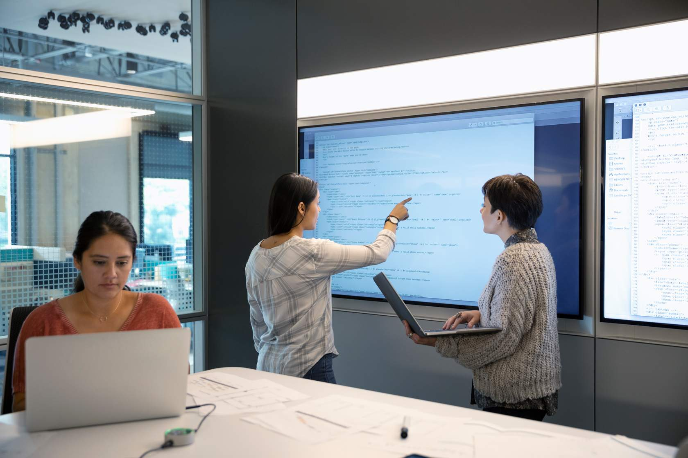

# Styled Webpage - Week 2 Assignment

This project is a simple styled webpage created as part of the Mesh Week 2 CareerEX assignment. It demonstrates the use of HTML and CSS to structure and style a webpage with multiple sections, images, and interactive elements.

## Project Structure

The project has the following structure:

### Files and Directories

- **index.html**: The main HTML file containing the structure of the webpage.
- **style/style.css**: The CSS file used to style the webpage.
- **image/**: A directory containing images used in the webpage.
- **.vscode/settings.json**: Configuration for the Live Server extension.

## Features

1. **Navigation Bar**: A simple navigation bar with links to "Home," "About," and "Contact."
2. **Three Sections**:
   - **Section One**: Contains two images, a paragraph, and a button.
   - **Section Two**: Contains two images, a paragraph, and a button.
   - **Section Three**: Contains two images, a paragraph, and a button.
3. **Responsive Design**: The webpage is styled to be responsive using CSS.

## How to Run

1. Open the project in Visual Studio Code.
2. Install the Live Server extension if not already installed.
3. Open `index.html` and start the Live Server by right-clicking and selecting "Open with Live Server."
4. The webpage will open in your default browser on port `5501` (as configured in `.vscode/settings.json`).

## Screenshots

### Section One

### Section Two

### Section Three

## Technologies Used

- **HTML**: For structuring the webpage.
- **CSS**: For styling the webpage.

## License

This project is for educational purposes and does not have a specific license.
